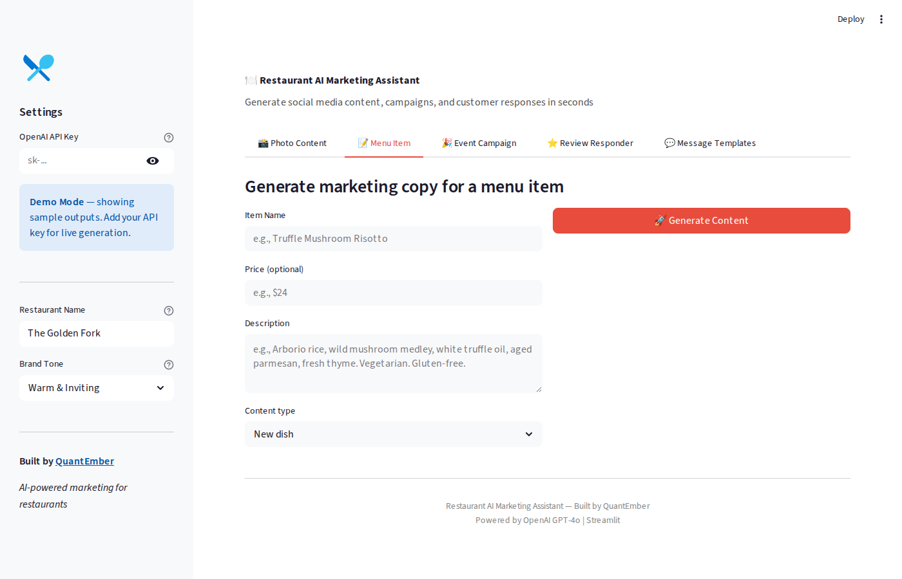
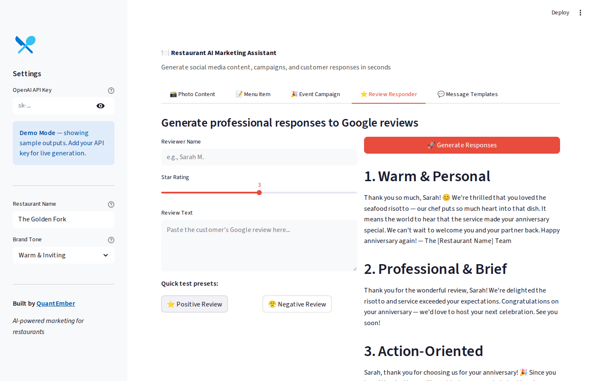

# Restaurant AI Marketing Assistant

AI-powered marketing content generator and customer engagement tool for restaurants.

Upload a food photo or enter menu item details — get instant Instagram captions, Facebook posts, campaign ideas, hashtags, audience targeting, and Google review responses.





## Features

| Feature | Description |
|---------|-------------|
| **Photo Content** | Upload food/drink photos → multi-platform captions via GPT-4o Vision |
| **Menu Item Copy** | Name + price + description → IG, FB, X posts with hashtags and CTAs |
| **Event Campaigns** | Event details → pre/during/post promotional content + audience targeting |
| **Review Responder** | Paste a Google review → 3 professional response options (warm, brief, action-oriented) |
| **Message Templates** | Customer DMs → 2-3 reply templates with personalization placeholders |

## Quick Start

```bash
pip install -r requirements.txt
streamlit run app.py
```

The app runs in **demo mode** with sample outputs. Add your OpenAI API key in the sidebar for live generation.

## Configuration

- **OpenAI API Key**: Enter in sidebar or set `OPENAI_API_KEY` environment variable
- **Restaurant Name**: Customize in sidebar (used in review responses)
- **Brand Tone**: Choose from Warm & Inviting, Modern & Trendy, Classic & Elegant, Casual & Fun

## Cost

- OpenAI API: ~$0.01-0.03 per generation (GPT-4o)
- Photo analysis: ~$0.03-0.05 per image (GPT-4o Vision)
- No monthly platform fees — just API usage

## Tech Stack

- **Frontend**: Streamlit
- **AI**: OpenAI GPT-4o / GPT-4o Vision
- **Deployment**: Streamlit Community Cloud (free) or any Python host

## Deploy to Streamlit Cloud

1. Push this repo to GitHub
2. Go to [share.streamlit.io](https://share.streamlit.io)
3. Connect repo → select `app.py`
4. Add `OPENAI_API_KEY` in Streamlit secrets
5. Done — live URL in 60 seconds

## License

MIT License — QuantEmber
